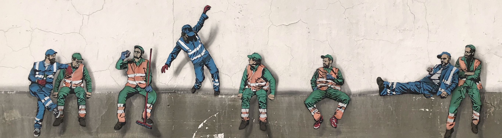

By Dean Baltiansky

# Background

# Summary

To test this, we conducted a set of complementary mixed-methods studies. First, we  

# Study 1

  

    <a href="./studies/study-1/index.html" target="_blank" rel="noopener"
       style="background:#0b69ff;color:white;padding:0.55em 0.9em;border-radius:8px;text-decoration:none;display:inline-block;margin:0;">
      FULL REPORT ↗
    </a>
  

# Study 2

# Study 3

# Study 4

# Study 5
